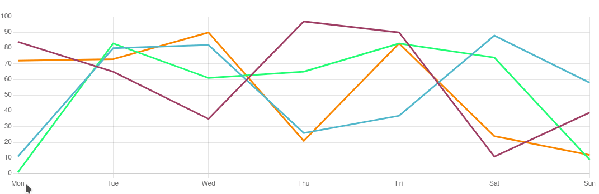

# Example of an external tooltip in ChartJS + React + TS + Chakra

This repository contains a simple example on how to make a custom external tooltip via ChartJS using React & Chakra UI.

Demo:



## Run the project

```bash
yarn && yarn dev
```
